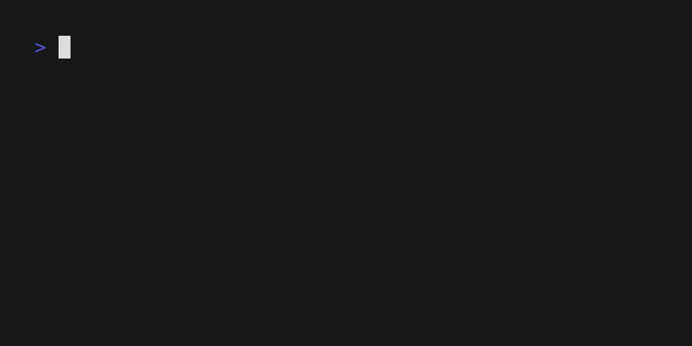

# hai

Meet **hai**, a tiny CLI tool that turns natural language into shell commands.
You describe what you want to do, hai suggests a command, and asks if you'd like
to run it. A simple, unix-y tool that does one thing /really/ well.



```console
$ hai "use pandoc to convert all the markdown files in this directory to an ebook"
Command: pandoc -f markdown -t epub -o book.epub *.md
✔ Looks good?
```

Just describe what you want:

```console
hai "copy all txt files to the backup directory"
```

Or pipe stuff into it `hai`:

```basconsole
cat some-file | hai
```

Some more examples:

```console
$ hai "find and delete all log files"
Command: find . -name "*.log" -delete
```

```console
$ hai "list all running docker containers"
Command: docker ps
```

```console
$ hai "find all jpg files and resize them to 800px wide"
Command: find . -name "*.jpg" -print0 | xargs -0 mogrify -resize 800x
```

```console
$ hai "search all markdown files for TODO and save the results to todos.txt"
Command: grep -r "TODO" *.md > todos.txt
```

## Documentation

Full documentation is available in the man pages:

- [hai(1)](doc/manual.md) - Main command documentation
- [hai-config(5)](doc/config.md) - Configuration file documentation

All installation methods include these man pages, which are installed to
standard system locations and can be accessed with `man hai` and `man
hai-config` after installation.

## Installation

### Using the Shell Installer (macOS, Linux)

The easiest way to install hai on macOS or Linux is using the shell installer:

```bash
# Install the latest version
curl --proto '=https' --tlsv1.2 -LsSf https://github.com/gregbell/hai/releases/latest/download/hai-installer.sh | sh
```

This will install hai to `~/.local/bin` (following XDG standards) and man pages to standard system locations.

### Using PowerShell Installer (Windows)

For Windows users, you can install hai using PowerShell:

```powershell
# Install the latest version
irm https://github.com/gregbell/hai/releases/latest/download/hai-installer.ps1 | iex
```

### Using Homebrew (macOS, Linux)

```bash
# Add the tap and install
brew tap gregbell/tap/hai
```

### From GitHub Releases

You can download pre-built binaries for your platform from the [GitHub Releases page](https://github.com/gregbell/hai/releases).

### From Source

1. Clone the repository:

   ```bash
   git clone https://github.com/gregbell/hai.git
   cd hai
   ```

2. Build and install:

   ```bash
   # Build and install to ~/.local/bin (XDG standard location)
   make local-install

   # Or for a system-wide installation
   sudo make install
   ```

3. Run hai for the first time to set up your configuration:

   ```bash
   hai
   ```

This will guide you through setting up your configuration and API keys.

## Contributing

We would love your help with Hai! If you want to discuss Hai, The best place
is the Github discussions: https://github.com/gregbell/hai/discussions.

If you run into a bug or want to contribute with code, open an issue or PR. We'd
love to see them.

hai is written in Rust. To build from source:

```bash
git clone https://github.com/gregbell/hai.git
cd hai

# Install pandoc (required for building man pages)
# On Debian/Ubuntu: apt-get install pandoc
# On macOS: brew install pandoc
# On Windows: choco install pandoc

# Build the application and documentation
make

# Run tests
make test

# Build only the documentation
make doc

# Clean build artifacts
make clean
```

### Creating a Release

To create a release tarball:

```bash
make release VERSION=0.2.0
```

This will:

1. Update the version in Cargo.toml
2. Build the application
3. Create a release tarball with the binary, documentation, and man pages
4. Output instructions for creating a git tag

### Bumping Version

To bump the version across all project files:

```bash
make bump-version VERSION=0.2.0
```

This will update the version number in:

- Cargo.toml
- Documentation files
- Test files
- README.md
- CHANGELOG.md (adds a new entry)

After running this command, you should:

1. Review and update the CHANGELOG.md with the new features/fixes
2. Commit the changes
3. Create a release when ready

## License

This project is Copyright 2025 Greg Bell and licensed under the GPL-3.0. See [LICENSE](LICENSE).
